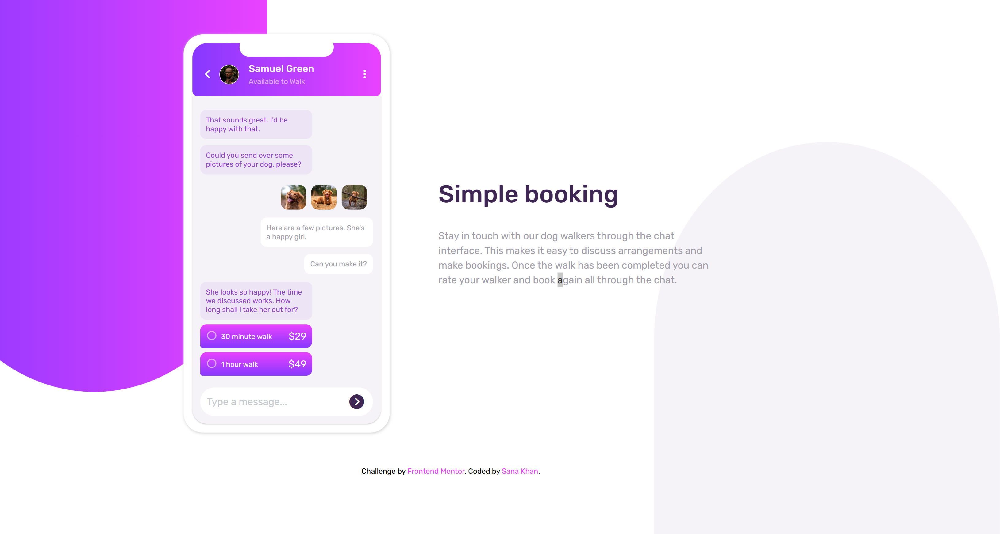

# 💬 Chat App CSS Illustration

[](https://www.frontendmentor.io/challenges/chat-app-css-illustration-O5auMkFqY)

A sleek, responsive chat app interface built purely with HTML and CSS. Showcase your dog-walking booking skills with this eye-catching mobile mockup! 🐶📱

## 📋 Table of Contents

- [💬 Chat App CSS Illustration](#-chat-app-css-illustration)
  - [📋 Table of Contents](#-table-of-contents)
  - [🌟 Overview](#-overview)
    - [The Challenge](#the-challenge)
    - [Screenshots](#screenshots)
      - [Desktop Design](#desktop-design)
      - [Mobile Design](#mobile-design)
    - [Links](#links)
  - [🛠️ My Process](#️-my-process)
    - [Built With](#built-with)
    - [What I Learned](#what-i-learned)
    - [Continued Development](#continued-development)
  - [👩‍💻 Author](#-author)

## 🌟 Overview

### The Challenge

Users should be able to:
- View the optimal layout for the component depending on their device's screen size
- **Bonus**: See the chat interface animate on the initial load (via CSS transitions)


### Screenshot



### Links

- **Solution URL**: [Frontend Mentor Solution](https://www.frontendmentor.io/solutions/chat-app-css-illustration-html-css-only-responsive-abc123)
- **Live Site**: [View Live](https://sana-zen.github.io/chat-app-css-illustration/)

## 🛠️ My Process

### Built With

- **Semantic HTML5** markup
- **CSS Custom Properties** for theming
- **Flexbox** for layout
- **Mobile-first** responsive design
- **CSS Gradients** for vibrant backgrounds
- **Font Awesome** icons
- **Google Fonts** (Rubik)

### What I Learned

Mastered advanced CSS techniques like pseudo-elements for decorative backgrounds and precise positioning for mobile UI elements. Here's a snippet of the gradient background magic:

```css
body::before {
  background: linear-gradient(to left, hsl(293, 100%, 63%), hsl(264, 100%, 61%));
  border-radius: 0 0 50% 50%;
}
```

### Continued Development

- Explore CSS animations for more interactive elements
- Implement accessibility best practices (ARIA labels, focus states)
- Experiment with CSS Grid for complex layouts

## 👩‍💻 Author

- **GitHub**: [@sana-zen](https://www.github.com/sana-zen)
- **Frontend Mentor**: [@sana-zen](https://www.frontendmentor.io/profile/sana-zen)
- **LinkedIn**: [Sana Khan](https://www.linkedin.com/in/sana-khan10/)
